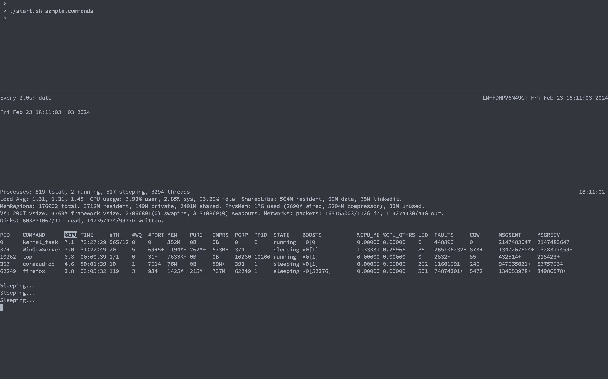

# run-with-tmux

A bash script to run concurrent applications in tmux panels.

## Dependencies

- Bash -- https://www.gnu.org/software/bash/ (you probably already have it)
- Tmux -- https://github.com/tmux/tmux/wiki

## Install & config

```bash
# Download the latest version from https://github.com/paulodiovani/run-with-tmux/raw/main/start.sh
# you can use curl, wget or even a browser
curl -LJO https://github.com/paulodiovani/run-with-tmux/raw/main/start.sh

# Make it executable
chmod +x start.sh

# Create your launch config in a new text file, with one command per line,
# commands can be anything that you can run on a terminal, from command line tools,
# docker containers, development applications, etc.
<<EOF > sample.commands
watch date
top
while while true; do echo "Sleeping..."; sleep 2; done;
EOF
```

## Run

Run the `start.sh` script with the `*.commands` file as argument.

```bash
./start.sh sample.commands
```

Once running, you can navigate through panels as always (default: `Ctrl+b, arrows`).

Type `Ctrl+C` in a panel to stop the command/application, which will also close the panel.

## Screenshots


